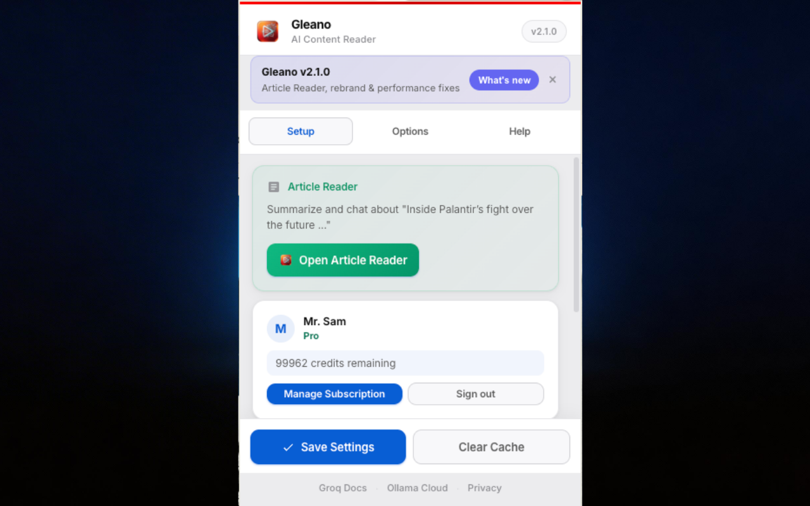

<div align="center">


# YouTube AI Summarizer

### Stop watching. Start reading.

**Turn any YouTube video into a 30-second read — summary, key points, detailed analysis, a two-host AI podcast, and a transcript-grounded chat. Free managed credits with Google sign-in, or bring your own API keys. No ads. No trackers. No 45-minute videos with 3 minutes of useful content.**

<br />

<a href="https://chromewebstore.google.com/detail/dkbgkfeobjailmeiaidmapifohkjpgji">
  
</a>
&nbsp;
<a href="https://cemkoyluoglu.codes/yt-ai-summarizer/">
  
</a>
&nbsp;
<a href="privacy-policy.html">
  
</a>

<br /><br />

<a href="https://github.com/CemRoot/yt-ai-summarizer/actions/workflows/ci.yml">
  
</a>


</div>

<br />

---

## Why people install it

<table>
  <tr>
    <td width="33%" valign="top">
      <h3>⚡ Understand a video in 30 seconds</h3>
      One prompt returns <b>Summary</b>, <b>Key Points</b>, and <b>Detailed Analysis</b> in a single round-trip — no waiting three times, no rate-limit loop.
    </td>
    <td width="33%" valign="top">
      <h3>🎙️ Listen to it like a podcast</h3>
      NotebookLM-style two-host <b>AI podcast</b> from the summary, randomized male/female Gemini TTS voices, volume control and <b>WAV download</b> for offline listening.
    </td>
    <td width="33%" valign="top">
      <h3>💬 Ask it anything</h3>
      Transcript-grounded <b>Chat</b> — follow-up questions answered only from what the video actually says, with full conversation history.
    </td>
  </tr>
  <tr>
    <td valign="top">
      <h3>🌍 20+ output languages</h3>
      EN, TR, ES, FR, DE, JA, KO, ZH, PT, AR, HI and more — summary language is independent of video language.
    </td>
    <td valign="top">
      <h3>🔐 Private by design</h3>
      No analytics SDKs, no ad trackers. BYOK keys stay on your device (obfuscated). Managed mode is a thin Supabase Edge layer you can audit.
    </td>
    <td valign="top">
      <h3>🧩 Works the way you want</h3>
      <b>Managed AI</b> (Google sign-in, free credits, optional Pro) <i>or</i> <b>BYOK</b> (Groq / Ollama Cloud / Gemini). Switch anytime.
    </td>
  </tr>
</table>

<br />

<div align="center">
  
  <br /><sub>The in-extension <i>What's New</i> panel — same design language as the summary panel, welcome flow, and popup.</sub>
</div>

---

## How it works

### Two paths, same panel

```text
┌──────────── Managed AI (default — no keys) ───────────────────────────────┐
│                                                                           │
│  YouTube ─▶ Transcript ─▶ service-worker ─▶ Supabase JWT                  │
│                                              │                            │
│                                              ├─▶ check-credits (Edge)     │
│                                              └─▶ summarize   (Edge)       │
│                                                     │                     │
│                                                     ▼                     │
│                                        DeepSeek + Gemini (server keys)    │
│                                                     │                     │
│                                                     ▼                     │
│                                        Side panel in YouTube              │
└───────────────────────────────────────────────────────────────────────────┘

┌──────────── BYOK (your keys, direct) ─────────────────────────────────────┐
│                                                                           │
│  YouTube ─▶ Transcript ─▶ service-worker ─▶ Groq | Ollama | Gemini TTS    │
│                                                     │                     │
│                                                     ▼                     │
│                                        Side panel + LRU cache (20 videos) │
└───────────────────────────────────────────────────────────────────────────┘
```

1. **Transcript extraction** — InnerTube / ANDROID client against YouTube's own caption endpoints. No third-party transcript scraper.
2. **One round-trip** — a single prompt produces Summary + Key Points + Detailed Analysis. Podcast and Chat reuse the same transcript context.
3. **4-layer parser** — delimiters → regex → headings → split. Resilient to models that drift from the requested format.
4. **Instant tab switching** — in-memory + persistent LRU cache (max 20 videos). Summary / Key Points / Detailed render from cache while background work continues.
5. **Credit-aware** — managed calls are gated by a server-side pre-flight estimator; no overdraft, no "3 credits showing but charged 7".

---

## Plans

<table>
  <tr>
    <th align="left" width="33%">Free (managed)</th>
    <th align="left" width="33%">Pro (managed)</th>
    <th align="left" width="33%">BYOK</th>
  </tr>
  <tr>
    <td valign="top">
      Sign in with Google. Free credits refresh automatically. Summary, Key Points, Detailed, and Chat on managed servers.
      <br /><br />
      <b>Best for</b> casual viewers who don't want to manage API keys.
    </td>
    <td valign="top">
      Monthly or yearly upgrade via Stripe. Higher monthly credit limit, priority on long videos, podcast generation included.
      <br /><br />
      <b>Best for</b> regular viewers and learners.
    </td>
    <td valign="top">
      Bring your own Groq / Ollama Cloud key (summary + chat) and optional Gemini key (podcast TTS). Traffic goes browser → vendor — we never see it.
      <br /><br />
      <b>Best for</b> developers, privacy-first users, and anyone with existing vendor credits.
    </td>
  </tr>
</table>

> Pro billing is handled by Stripe. Cancel anytime from the **Manage Subscription** button in the popup.

---

## Getting started

### Install

**Recommended (1-click):**
<a href="https://chromewebstore.google.com/detail/dkbgkfeobjailmeiaidmapifohkjpgji">Install from the Chrome Web Store</a>.

**From source (developers):**

```bash
git clone https://github.com/CemRoot/yt-ai-summarizer.git
```

Then in Chrome:
1. Open `chrome://extensions/`
2. Enable **Developer mode** (top-right)
3. Click **Load unpacked** → select the repo folder

### Choose a mode

<details>
<summary><b>Option A — Managed AI (no API key)</b></summary>

1. Open the welcome page (opens automatically after install) → **Sign in with Google**.
2. The extension talks to **Supabase** (Auth + Edge Functions) for credits and summarization.
3. Optional **Pro** upgrade via Stripe when the free credits don't fit your usage.

</details>

<details>
<summary><b>Option B — Bring your own key (BYOK)</b></summary>

Pick a provider and paste the key into the popup:

| Provider | Get a key | Free tier |
|---|---|---|
| **Ollama Cloud** _(recommended)_ | [ollama.com/settings/keys](https://ollama.com/settings/keys) | Gemini 3 Flash + 10 more models, free tier |
| **Groq** | [console.groq.com/keys](https://console.groq.com/keys) | 30 RPM, up to 500K tokens/day |

For the **AI Podcast** (BYOK), also add a free **Gemini API key** ([aistudio.google.com/apikey](https://aistudio.google.com/apikey)) for TTS.

</details>

### Use it

1. Open any YouTube video.
2. Click the floating brain icon on the right side of the player.
3. Pick a tab — Summary, Key Points, Detailed, Podcast, or Chat.
4. Summaries are cached for 20 videos; tab switches are instant.

---

## AI models

<details>
<summary><b>Groq (BYOK)</b> — ultra-fast LPU inference</summary>

| Model | Speed | Quality | Best for |
|---|---|---|---|
| Llama 3.3 70B | ⚡⚡ | ★★★★★ | Highest-quality summaries |
| Llama 3.1 8B | ⚡⚡⚡ | ★★★ | Fast results, higher rate limit |
| Llama 4 Scout 17B | ⚡⚡ | ★★★★ | New-generation model |
| Qwen3 32B | ⚡⚡ | ★★★★ | Strong reasoning |

</details>

<details>
<summary><b>Ollama Cloud (BYOK)</b> — flexible open models</summary>

| Model | Size | Best for |
|---|---|---|
| **Gemini 3 Flash** ⭐ | — | **Default** — fast and high quality |
| Qwen3-Next 80B | 80B | Reasoning & thinking |
| DeepSeek V3.2 | 671B | Most powerful |
| GPT-OSS 120B | 120B | General purpose |
| Kimi K2.5 | — | Multimodal |
| Devstral Small | 24B | Code-focused |

</details>

<details>
<summary><b>Managed AI (server-side)</b> — DeepSeek + Gemini behind Supabase Edge</summary>

Summary and Chat run on **DeepSeek** text models; Podcast TTS runs on **Gemini 2.5 Flash Preview TTS**. Costs are metered per token (real `usageMetadata`, not flat rates) and gated by a server-side pre-flight credit estimator so you can never be charged for a call you cannot afford.

</details>

---

## Privacy & security

<table>
  <tr>
    <td width="50%" valign="top">
      <h3>✅ No ads, no in-extension analytics</h3>
      No Mixpanel, no Segment, no PostHog. The extension ships without telemetry SDKs.
    </td>
    <td width="50%" valign="top">
      <h3>✅ BYOK keys stay on your device</h3>
      API keys are XOR-obfuscated in <code>chrome.storage.local</code>. Transcripts and prompts go <b>directly</b> from your browser to the provider.
    </td>
  </tr>
  <tr>
    <td valign="top">
      <h3>✅ Managed AI is an auditable thin layer</h3>
      Google sign-in via <b>Supabase Auth</b>. Managed calls go to <b>Supabase Edge Functions</b> which proxy to DeepSeek/Gemini. Stripe handles optional billing.
    </td>
    <td valign="top">
      <h3>✅ Minimal permissions</h3>
      <code>storage</code>, <code>activeTab</code>, <code>identity</code>, plus explicit host access for YouTube, BYOK vendors, and our Supabase project. See <a href="manifest.json"><code>manifest.json</code></a>.
    </td>
  </tr>
</table>

Full policy in [`privacy-policy.html`](privacy-policy.html) (bundled with the extension, dark-mode aware). Independent security review runs before every Chrome Web Store release — see the changelog for audit fixes.

---

## What's new

### v2.0.2 — April 2026

- **🧾 Correct "credits exhausted" message for managed users** — when you run out of free credits (or our managed AI is temporarily unavailable), you now see a clear "Credits exhausted" / "Managed AI unavailable" card with an upgrade CTA, instead of the misleading "Invalid API Key" error that would appear on v2.0.1.
- **🛡️ No more credit deduction on empty provider replies** — if a text or TTS provider returns a 200-OK with a blank body (rare but observed), the edge function now returns `502 PROVIDER_EMPTY_RESPONSE` and skips `consume_credits` entirely. Your balance can never drift below what you actually received.
- **🎙️ Podcast always uses both voices** — podcast script is now generated by Gemini with a JSON schema enforcing `speaker ∈ {"Alex","Sam"}`, and a post-parse repair reassigns speakers alternately if any provider drifts. The "single voice reads everything" bug that hit live v2 is closed end-to-end.
- **⚡ Podcast ~17 % faster end-to-end** — script generation: 10.8 s → 5.2 s (−52 %) via Gemini-first routing; TTS: 53.9 s → 48.3 s via tighter 10–14 turn prompts. Total: 64.7 s → 53.5 s on a real 18-min benchmark (see internal `test-run-log.md` / `perf-benchmarks/2026-04-23-v2.0.2-prompts/`).
- **📝 Denser summaries on long videos** — prompt now sets explicit per-section length targets ("max ~180 words", "6–8 one-sentence takeaways", "4–6 sections of 2–4 sentences"). Wallclock stays ±2 s but visible word count drops 22–35 % on medium/long videos, with every cited study / name / figure preserved. Transcript coverage cap unchanged at 80 k chars (no silent truncation).

### v2.0.1 — April 2026

- **🛡️ Credit overdraft fix (managed AI)** — server-side pre-flight credit estimator inside `summarize`; UI "credits remaining" can never drift from the server balance again (migration `009`).
- **📈 Truthful Gemini TTS cost** — per-token pricing from the official [Gemini pricing table](https://ai.google.dev/gemini-api/docs/pricing) instead of a flat rate; real `usageMetadata` logged to `usage_log`.
- **🧩 `podcast-tts` logging restored** — migration `010` adds the `podcast-tts` enum so every TTS row is metered (fixes a silent COGS hole).
- **🎨 Redesigned privacy page** — dark-mode support, "At a glance" trust-signal grid, BYOK vs Managed AI mode-comparison card. Legal wording unchanged.
- **🔐 Security audit pass (pre-CWS)** — fixed avatar-URL `innerHTML` vector in popup + welcome, and stripped `access_token` / `refresh_token` from `chrome.storage.session` popup cache (audit-driven).
- **🖼️ New icons** — refreshed 16 / 32 / 48 / 128 px PNGs; manifest now declares a `32` bucket so Chrome picks the exact menu size.
- **🚀 Production managed AI** — live Google OAuth + live Stripe; `.env.example` is a live-ready template.
- **🧹 Public-repo hygiene** — `.gitignore` hardened (`docs/**` private except the five GitHub Pages assets); internal E2E checklist moved to maintainers-only.

### v2.0.0

- **📋 Privacy & docs** — `privacy-policy.html` and README disclose managed AI (Supabase, Google OAuth, Stripe), BYOK vs server-side processing, fingerprint/abuse limits, and `identity` + Supabase host permissions.
- **🚀 Freemium v2** — Managed AI (Supabase Edge + Google sign-in), Stripe Pro, device fingerprinting, hardened JWT verification. BYOK stays supported.
- **📐 DRY billing constant** — `PRO_MONTHLY_AI_CREDIT_LIMIT` centralized in `backend/supabase/functions/_shared/billing-constants.ts`.
- **💬 Chat quality** — stronger transcript-only system prompts on managed Edge and BYOK service worker.

<details>
<summary>Older versions (v1.x) — 20+ entries</summary>

### v1.8.2
- Update page polish, YouTube favicon, Open Settings via popup with in-page toast fallback, Previous Versions toggle CSS fix.

### v1.8.1
- Store resubmit bump; popup and What's New now read `chrome.runtime.getManifest().version`; distribution ZIP includes `update/`.

### v1.8.0
- **🎙️ Podcast TTS model fix** — migrated to `gemini-2.5-flash-preview-tts`; fixes "model not found".
- **🔊 Podcast volume** + **📥 WAV download**.
- **🔄 Non-blocking tab switching** — per-pipeline busy flags; tab switches stay instant during generation.

### v1.7.x
- v1.7.2 — Uninstall URL moved to portfolio domain.
- v1.7.1 — Privacy policy redesign + Pages landing polish.
- v1.7.0 — **Interactive Video Chat**, fullscreen auto-hide, chat context aligned at 80K chars.

### v1.6.x
- v1.6.4 — Gemini TTS model update, auto-merge pipeline, branch protection, CODEOWNERS.
- v1.6.3 — InnerTube ANDROID client bump (v21.03.36, SDK 35), dynamic WEB client fallback, weekly Version Monitor, daily Transcript Health Check, Version Consistency CI, `uninstall_url`, troubleshooting guide.
- v1.6.2 — Store CRX cache bust.
- v1.6.1 — Searchable language menu, cache-control toggles, API key XOR+Base64 obfuscation, welcome-page i18n fix, CI security checks.
- v1.6.0 — Random podcast voice pairs, 11-language welcome page (incl. RTL Arabic), inline Gemini key setup, full security audit.

### v1.5.0
- **🎙️ Gemini 2.5 Flash TTS** podcast — multi-speaker single-audio, full player, region restrictions localized.

### v1.4.0
- **🎙️ AI Podcast** v1 — NotebookLM-style two-host script + Web Speech API playback with live subtitles.

### v1.3.0
- Fun Facts during loading, Ollama + Gemini 3 Flash as default provider/model.

### v1.2.x
- v1.2.3 — ~3× faster for long videos (chunk 24K→80K, parallel batches of 3).
- v1.2.2 — LRU cache index (max 20 videos, max ~800 KB).
- v1.2.1 — SPA-nav fix, "Summarize this video?" start prompt, 8-language localization.
- v1.2.0 — Dual provider, UI/UX redesign, 20+ languages, onboarding tooltip, 4-layer parser, GitHub Actions CI/CD.

### v1.0.x
- v1.0.2 — Credentials on all YouTube fetches.
- v1.0.1 — Empty transcript bug fixed.
- v1.0.0 — Initial release.

</details>

---

## FAQ & troubleshooting

<details>
<summary><b>"This extension is not trusted by Enhanced Safe Browsing" — is it safe?</b></summary>

Yes. That warning appears for **every new** Chrome extension. It is not a security signal — Google just hasn't yet built a long compliance history for the developer account. It disappears automatically after a few months of clean store presence. Click **Continue to install**.
</details>

<details>
<summary><b><code>CRX_FILE_NOT_READABLE</code> when reinstalling</b></summary>

Chrome's internal download cache holds a stale reference after uninstall + immediate reinstall.
**Fix:** quit Chrome completely, reopen, then install again from the Web Store.
</details>

<details>
<summary><b>Extension isn't showing on YouTube</b></summary>

- Confirm you're on `youtube.com` (not an embedded player on another site).
- Check `chrome://extensions/` → extension is enabled.
- Refresh the YouTube tab (Cmd/Ctrl + R).
- If you just installed, navigate to a new video.
</details>

<details>
<summary><b>Caption / transcript unavailable</b></summary>

Some videos have captions disabled or rely on ASR-only in unsupported languages. The extension tries multiple InnerTube client contexts and falls back to the WEB client before giving up. If you see "No captions available" on a video that clearly has captions, open an issue with the video ID — it's often a YouTube API change we can patch server-side.
</details>

---

## For developers

<details>
<summary><b>Tech stack</b></summary>

- **Client:** Manifest V3 Chrome extension — vanilla ES modules, ES6 classes with private fields (`#`), no build step, no TypeScript compile.
- **Background:** `service-worker.js` owns AI routing, auth messages, transcript proxy, and pre-flight credit gating.
- **Backend:** Supabase (Postgres + Edge Functions in TypeScript/Deno). Shared billing constants live in `backend/supabase/functions/_shared/`.
- **AI providers:** DeepSeek (managed text), Gemini 2.5 Flash Preview TTS (managed + BYOK podcast), Groq and Ollama Cloud (BYOK text).
- **Billing:** Stripe (monthly + yearly Pro). Webhook → Supabase triggers plan + credit cascades.
- **OAuth:** Google via Supabase Auth (PKCE) + `chrome.identity.launchWebAuthFlow`.

</details>

<details>
<summary><b>Repository layout</b></summary>

```text
yt-ai-summarizer/
├── manifest.json                   Manifest V3
├── service-worker.js               Background: BYOK + managed AI routing, auth messages
├── backend/supabase/               Edge Functions, SQL migrations, shared billing (private repo)
├── content/
│   ├── content.js                  Main controller — cache, SPA nav, chat orchestration
│   ├── content.css                 Panel + dark/light theme + chat UI
│   ├── transcript.js               InnerTube transcript extractor
│   ├── ui.js                       Panel UI, tabs, onboarding tooltip, credit badges
│   ├── podcast.js                  Podcast audio player
│   └── page-bridge.js              MAIN-world bridge for YT internal data
├── popup/                          Settings popup (dual provider + managed account)
├── welcome/                        Onboarding flow (Sign in with Google or BYOK)
├── update/                         "What's New" page shown after updates
├── utils/
│   ├── storage.js                  Settings + BYOK obfuscation + Supabase session + persistent device id
│   ├── supabase-auth.js            Google OAuth (PKCE) via Supabase Auth REST
│   ├── api-client.js               Edge Function client (auth-callback, check-credits, summarize)
│   ├── fingerprint.js              Device fingerprint (managed sign-in / abuse limits)
│   ├── auth-debug-log.js           Optional local auth diagnostics
│   └── gemini-pcm-wav.js           Gemini TTS PCM → WAV export + download
├── icons/                          16 / 32 / 48 / 128 px extension icons
├── _locales/                       en + tr message catalogs
├── privacy-policy.html             Bundled privacy policy (dark-mode aware)
├── docs/                           GitHub Pages landing + uninstall template
└── .github/workflows/              ci.yml, github-pages.yml
```

</details>

<details>
<summary><b>CI/CD</b></summary>

Every push to `main` runs, in `.github/workflows/ci.yml`:

| Job | What it does |
|---|---|
| **Manifest Check** | JSON validity, required fields, `manifest_version: 3`, referenced file existence |
| **JS Lint** | `node --check` on every `.js` file, JSON validity, HTML structure |
| **Security Audit** | Hardcoded-key grep, `eval` / `document.write` ban, CSP check, host permission audit, debug-ingest ban (`127.0.0.1:7243`) |
| **Version Consistency** | `manifest.json` ↔ `privacy-policy.html` ↔ README top changelog entry must match |
| **Build & Package** | Versioned `.zip` artifact for Chrome Web Store submission (excludes `*.test.js`, swap files, `.DS_Store`) |

**Scheduled:**

| Workflow | Cadence | What it does |
|---|---|---|
| **YouTube Version Monitor** | Mon & Thu 09:00 UTC | Compares the ANDROID client version against NewPipeExtractor; opens an auto-mergeable PR if it's behind. |
| **Transcript Health Check** | Daily 06:00 UTC | Calls the InnerTube caption endpoint against a known video; opens an Issue on failure. |

</details>

<details>
<summary><b>Local tests</b></summary>

```bash
node --check service-worker.js
node --test content/transcript.orchestration.test.js
```

`*.test.js` files are present in the repo for local development but are **excluded from the Chrome Web Store ZIP** by the `ci.yml` packaging step.

</details>

<details>
<summary><b>Maintainer pre-release checklist</b></summary>

- **Security.** CI runs secret-pattern grep, CSP check, manifest file-reference check, and debug-ingest ban. Keep `host_permissions` minimal.
- **Debug noise.** No `console.log` / `console.warn` / `debugger` in shipping paths. `console.error` is reserved for real failures (missing deps, fatal extension state).
- **Architecture.** Prefer ES6 classes and shared helpers (`StorageHelper`, controllers, UI modules). Do not duplicate secrets or API base URLs outside `utils/storage.js` + `service-worker.js`.
- **Versions.** `manifest.json`, `privacy-policy.html`, and the top changelog entry must match — CI enforces this via the **Version Consistency** job.
- **Uninstall page.** After editing `docs/uninstall.html`, copy it to the portfolio Vercel project at `public/yt-ai-summarizer/uninstall.html` and redeploy so the live URL matches `UNINSTALL_FEEDBACK_URL` in `service-worker.js`.

</details>

<details>
<summary><b>Uninstall feedback URL</b></summary>

The post-uninstall page is served **only** from the portfolio deployment at **<https://cemkoyluoglu.codes/yt-ai-summarizer/uninstall.html>**. `docs/uninstall.html` in this repo is the source-of-truth template; it does **not** change what users see until it is copied into the portfolio repo and redeployed (Vercel).

The constant `UNINSTALL_FEEDBACK_URL` in `service-worker.js` must match the live URL exactly, including `www` vs apex if you standardize on one.

[`.github/workflows/github-pages.yml`](.github/workflows/github-pages.yml) can still publish `docs/` for testing or redirects; the extension will not point there unless `UNINSTALL_FEEDBACK_URL` is changed.

</details>

---

## Requirements

- **Google Chrome ≥ 111** (or Chromium-based browser with MV3 support).
- One of:
  - A **Google account** (for free managed AI + optional Pro), or
  - A **Groq** or **Ollama Cloud** API key (for BYOK). A free **Gemini API key** is additionally needed if you want the BYOK podcast.

---

## Contributing

1. Fork the repo
2. Create a feature branch — `git checkout -b feature/your-idea`
3. Commit your changes following the existing style (ES6 classes, no TypeScript build, shared helpers over copy-paste)
4. Push and open a Pull Request — CI will run the full pipeline before review

Issues and design discussions are welcome — especially if you're a YouTube viewer with a concrete use case we haven't covered.

---

## License

MIT — free to use, modify, and distribute.

---

<div align="center">
  <sub>
    Built for people who learn faster by reading.<br />
    Built by people who got tired of 45-minute videos with 3 minutes of useful content.
  </sub>
  <br /><br />
  <a href="https://chromewebstore.google.com/detail/dkbgkfeobjailmeiaidmapifohkjpgji">
    
  </a>
</div>
